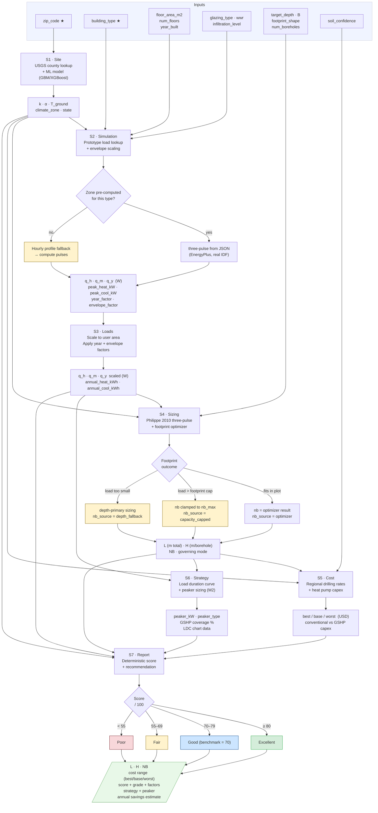
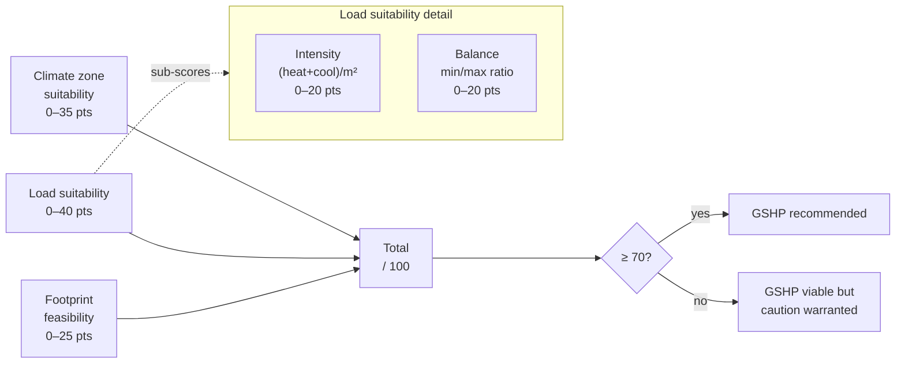

# GeoSite Advisor — Calculation Logic Tree

## Pipeline Diagram



★ = required. All others optional (defaults shown in `docs/design_brief.md`).

---

## Score Factor Breakdown



---

## Future Tool Notes

These came up in a talk. Assessment of where each one fits.

---

### Manual J  ✦ HIGH VALUE — input bypass pathway

**What it is:** ACCA Manual J is the US industry-standard room-by-room heating/cooling load calculation protocol used by HVAC engineers and contractors. Produces peak design loads in BTU/hr or kW.

**Where it fits:** Our tool currently derives peak loads from EnergyPlus (s2). Manual J gives the same information — peak heating and cooling loads — directly from the contractor's own report.

**Proposed use:** Add an expert input mode:

```
user has Manual J report
    → enter peak_heat_kW and peak_cool_kW directly
    → skip s2_simulation entirely
    → feed directly into s3_loads (derive q_m, q_y from shape factors)
```

Shape factor defaults: `q_m ≈ 0.40 × q_h`, `q_y ≈ 0.08 × q_h` (based on typical office load profiles from our EnergyPlus dataset). These are reasonable approximations for buildings where the contractor has already done Manual J.

**Priority:** Medium. Many commercial buildings already have Manual J from permit applications. This would open up the tool to users who don't want to re-simulate.

---

### OpenStudio  ✦ DEVELOPER IMPROVEMENT — simulation pipeline

**What it is:** NREL's SDK and GUI for EnergyPlus. Provides Python bindings (`openstudio` package), a library of pre-built "Measures" (parameterized model modifications in Ruby/Python), and a more robust model API than raw IDF manipulation.

**Where it fits:** Currently we use `eppy` to strip and rebuild HVAC in the DOE prototype IDFs. OpenStudio would replace eppy with a cleaner API.

**Proposed use:**
- Replace `run_energyplus_loads.py`'s IDF manipulation with OpenStudio Python SDK calls
- Use OpenStudio Measures for envelope variants (our current glazing/WWR/infiltration sweeps) — more maintainable than our patch scripts
- Better support for future prototype additions (e.g., midrise apartment which currently has no IDF)

**Caveat:** OpenStudio is a wrapper around EnergyPlus, not a replacement. We'd still be running EnergyPlus — just preparing the model differently. The precomputed JSON files and the rest of the pipeline stay the same.

**Priority:** Low–medium. Current eppy approach works for existing prototypes. Migrate when adding new building types or expanding the parametric sweep significantly.

---

### Revit  ✦ BIM DATA SOURCE — input enrichment

**What it is:** Autodesk BIM platform. A Revit building model contains accurate floor areas, room schedules, glazing areas, envelope constructions, and MEP systems.

**Where it fits:** GeoSite Advisor currently asks users to manually estimate floor area, WWR, glazing type. A real Revit model has all of this already.

**Proposed use:**
- Accept **gbXML export** from Revit (standard format for BIM → energy modeling hand-off)
- Auto-populate: floor_area_m2, num_floors, wwr, glazing U-value tier, infiltration class
- User just uploads the gbXML file and skips the manual input fields

**Caveat:** Our current target users are building owners, who typically don't have Revit models. Architects at design-phase do. This is valuable if we expand target users to architects evaluating GSHP before construction documents.

**Priority:** Low for v1 (building owners). High for v2 if we target architects/engineers at design stage.

---

### Ladybug / Honeybee  ✦ ALTERNATIVE SIMULATION — geometry-accurate loads

**What it is:** Open-source Python toolkit + Grasshopper components.
- **Ladybug**: climate data analysis (EPW processing, sun path, outdoor comfort). Not directly relevant to GSHP sizing.
- **Honeybee**: wraps EnergyPlus and Radiance to run simulations from arbitrary building geometry (not just pre-defined prototypes).

**Where it fits:** Our simulation pipeline is prototype-based — we have 16 building types × 16 climate zones pre-computed. Honeybee could run simulations from the user's actual building geometry instead.

**Proposed use:**
- If user provides a Rhino/Grasshopper model → Honeybee generates the EnergyPlus model from that geometry → we compute q_h/q_m/q_y from the simulation output → rest of pipeline is unchanged
- Replaces s2_simulation's prototype-lookup step with a live Honeybee simulation for custom geometry

**Caveat:** This is a much heavier workflow (requires Rhino license, model prep time). It targets architects doing design-phase analysis, not building owners doing feasibility checks. Also, Honeybee + EnergyPlus runtimes are the same ~15–60s per simulation as our current pipeline.

**Priority:** Low for the current tool. Very high if we add a "custom geometry" mode for the architect market.

---

### Grasshopper  ✦ EXTENSION PATHWAY — parametric studies for architects

**What it is:** Visual programming environment embedded in Rhino 3D. Used by architects for parametric design. Ladybug/Honeybee have first-class Grasshopper components.

**Where it fits:** GeoSite Advisor could be exposed as a Grasshopper component or REST API client. An architect could set up a Grasshopper script that:
1. Varies building orientation or glazing ratio
2. Calls the GeoSite Advisor API for each variant
3. Plots how GSHP suitability score changes across design options

**Proposed use:**
- Publish GeoSite Advisor as a simple REST API (it already is — Flask at `/calculate/smart`)
- Write a Grasshopper Python component that posts to the API and visualizes results
- This is ~1 day of work: the API side is already done

**Priority:** Medium if we want to reach the architect/engineer user segment quickly — the API client is trivial to write once someone has a Rhino setup.

---

## Summary Table

| Tool | Fits In | Implementation Cost | Priority |
|------|---------|---------------------|----------|
| Manual J | Input bypass (skip s2) | Low — add input mode to app.py | Medium |
| OpenStudio | Replace eppy in precompute | Medium — Python SDK migration | Low–Med |
| Revit (gbXML) | Input enrichment (populate s2 fields) | Medium — gbXML parser | Low (v1), High (v2) |
| Ladybug | Climate viz only | n/a | Not needed |
| Honeybee | Custom geometry simulation | High — requires Rhino workflow | Low (v1) |
| Grasshopper client | API extension for architects | Low — Python component in GH | Medium |
